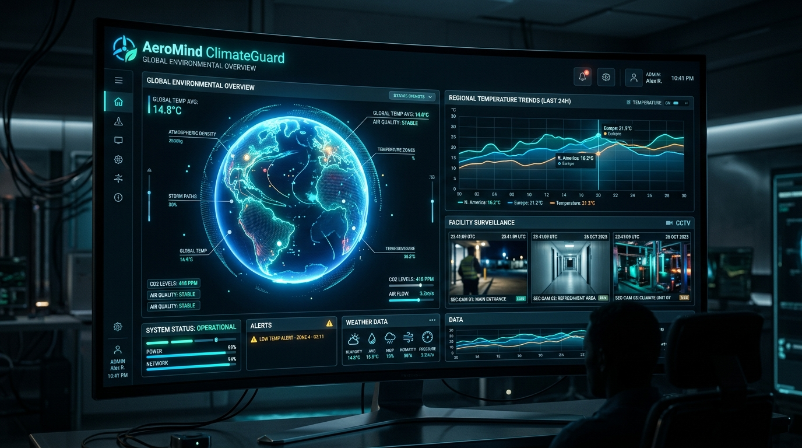
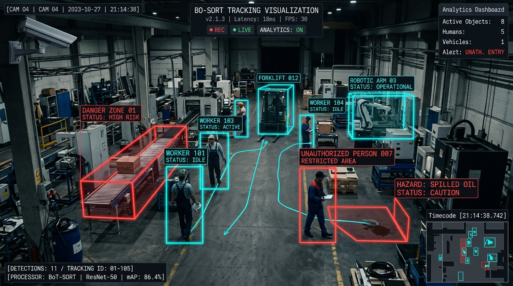
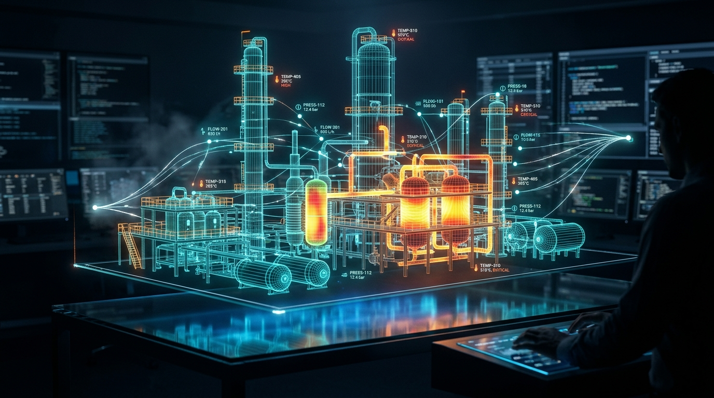
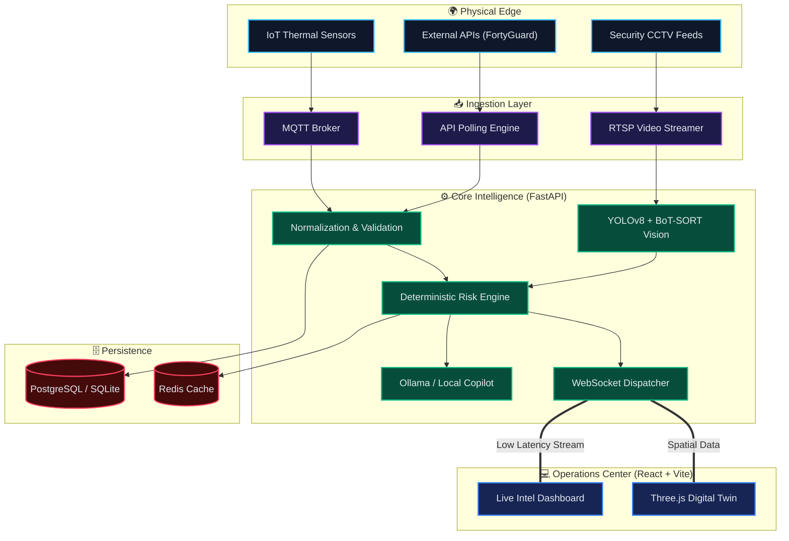

<div align="center">

# 🌍 AeroMind ClimateGuard
**Enterprise-Grade Physical AI & Industrial Telemetry Platform**

[](https://opensource.org/licenses/MIT)
[](https://fastapi.tiangolo.com)
[](https://react.dev)
[](https://threejs.org)
[](https://www.python.org)



**AeroMind ClimateGuard** is an advanced, multi-modal intelligence platform designed for industrial environments. It fuses real-time environmental telemetry, deep learning computer vision, and deterministic physical risk algorithms into a unified, low-latency 3D operational dashboard.

[Explore Documentation](docs/architecture.md) · [Report Bug](https://github.com/GhariebML/Aeromind-Guard/issues) · [Request Feature](https://github.com/GhariebML/Aeromind-Guard/issues)

</div>

---

## ⚡ Core Platform Capabilities

### 👁️ Autonomous Computer Vision & Object Tracking
Powered by **YOLOv8** and **BoT-SORT**, the platform achieves sub-20ms inference latency for detecting unauthorized personnel, thermal anomalies, and hazard zone breaches. The pipeline maintains persistent tracking IDs across occlusions.

<div align="center">
  
</div>

### 🗺️ Holographic 3D Digital Twin
A **WebGL-accelerated Three.js** environment reconstructs physical facilities into a highly interactive 3D digital twin. Visualize live heat maps, volumetric danger zones, and spatial sensor nodes in real-time.

<div align="center">
  
</div>

### 🧠 Deterministic Risk Fusion Engine
Unlike stochastic LLMs, our **Physical Risk Engine** uses pure mathematics and rules-based correlation to assign deterministic 0–100 risk scores. It intelligently fuses spikes in temperature with visual smoke confirmation to eliminate false positives.

### 📊 Real-Time Telemetry & Event Hub
Built on an asynchronous **FastAPI + WebSockets** backbone, the system dispatches live telemetry, alerts, and operational decisions instantaneously to the React frontend, handling thousands of concurrent sensor streams effortlessly.

---

## 🏗️ System Architecture

AeroMind operates on a highly scalable, decoupled microservices architecture.



---

## 🚀 Getting Started

### Prerequisites
- **Node.js** 18.x or higher
- **Python** 3.11 or higher
- **Git**

### 1️⃣ Clone the Repository
```bash
git clone https://github.com/GhariebML/Aeromind-Guard.git
cd Aeromind-Guard
```

### 2️⃣ Start the Backend (FastAPI)
```bash
# Create virtual environment
python -m venv venv
source venv/bin/activate  # On Windows: .\venv\Scripts\Activate.ps1

# Install dependencies
pip install -r requirements.txt

# Run the server (auto-seeds database on startup)
uvicorn apps.backend.src.main:app --host 0.0.0.0 --port 8000 --reload
```
> The API documentation will be available at [http://localhost:8000/docs](http://localhost:8000/docs)

### 3️⃣ Start the Frontend (React)
Open a new terminal window:
```bash
cd apps/frontend

# Install node modules
npm install

# Start development server
npm run dev
```
> The Operations Center will be available at [http://localhost:5173](http://localhost:5173)

---

## ☁️ Deployment

### 🐳 Docker Compose (Local/Production)
```bash
docker-compose up --build -d
```

### 🌐 Cloud Deployment (Vercel & Render)
This project is configured for split-stack cloud deployment:
1. **Backend (Render):** Deployed as a Docker Web Service using `docker/Dockerfile.backend`.
2. **Frontend (Vercel):** Deployed automatically via GitHub integration. Set the `VITE_API_URL` environment variable to your Render backend URL.

---

## 📚 Technical Documentation

For deep-dives into specific subsystems, please refer to our engineering docs:

| Module | Description | Link |
| :--- | :--- | :--- |
| **System Architecture** | High-level system design and data flow. | [docs/architecture.md](docs/architecture.md) |
| **Risk Engine** | Mathematics and algorithms behind deterministic risk. | [docs/risk-engine.md](docs/risk-engine.md) |
| **Video Analytics** | Pipeline details for YOLOv8 and tracking. | [docs/video-analytics.md](docs/video-analytics.md) |
| **REST API Specs** | Complete endpoint and WebSocket documentation. | [docs/api.md](docs/api.md) |

---
<div align="center">
  <p><i>UNAUTHORIZED ACCESS IS STRICTLY PROHIBITED</i></p>
  <p><b>AeroMind Operations Center v2.4.0</b></p>
</div>
