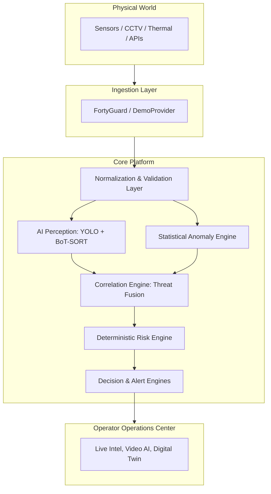

<div align="center">

# 🌍 AeroMind ClimateGuard

**Physical AI Operations Platform**

[](https://opensource.org/licenses/MIT)
[](https://fastapi.tiangolo.com)
[](https://react.dev)
[](https://threejs.org)
[](https://www.python.org)


**AeroMind ClimateGuard** is an enterprise-grade Physical AI intelligence platform that transforms multi-modal environmental telemetry, meteorological forecasts, and visual computer vision signals into actionable situational awareness, deterministic risk assessment, autonomous operational decision protocols, and 3D digital twin spatial intelligence.

</div>

---

## 🚀 Key Capabilities

| Capability | Description |
| :--- | :--- |
| 🛡️ **Deterministic Physical AI Risk Engine** | Computes continuous 0–100 risk scores with transparent factor attribution (temperature elevation, rate-of-change spikes, optical fire/smoke confirmation, danger zone proximity). Zero LLM hallucination in mathematical calculations. |
| 🔗 **Multi-Modal Correlation Engine** | Evaluates spatial-temporal rules fusing visual hazards (smoke/flame) with thermal telemetry and personnel tracking. |
| 👁️ **Computer Vision & Tracking Pipeline** | YOLOv8 object detection paired with BoT-SORT multi-object trajectory tracking and perimeter danger zone breach detection. |
| 🌐 **FortyGuard & Multi-Provider Ingestion** | Resilient provider abstraction with exponential backoff, rate limiting, and zero-crash initialization (`NOT_CONFIGURED` graceful fallback). |
| 🗺️ **Interactive 3D Digital Twin** | WebGL Three.js spatial visualization of monitored zones, heat halos, and animated camera frustum cones. |
| 🤖 **Grounded AI Copilot** | Local Ollama LLM integration strictly grounded in real database context with deterministic fallback when offline. |
| ⚡ **Real-Time WebSocket Hub** | Low-latency live stream dispatching telemetry updates, anomaly triggers, and alarm lifecycle changes. |

---

## 🧠 System Architecture



---

## 💻 Quick Start (Local Development)

### 1. Prerequisites
- **Python:** 3.11+
- **Node.js:** 18+ and npm
- **Optional:** Docker & Docker Compose
- **Optional:** Ollama with `llama3` installed

### 2. Backend Setup
```bash
# Clone and enter workspace
git clone https://github.com/aeromind/climateguard.git
cd aeromind-climateguard

# Create and activate Python virtual environment
python -m venv venv
# On Windows:
.\venv\Scripts\Activate.ps1
# On Linux/macOS:
source venv/bin/activate

# Install backend dependencies
pip install -r requirements.txt

# Start backend server with automatic seeder and simulator
uvicorn apps.backend.src.main:app --host 0.0.0.0 --port 8000 --reload
```

### 3. Frontend Setup
```bash
cd apps/frontend

# Install dependencies
npm install

# Start Vite dev server
npm run dev
```
> **Note:** Open **http://localhost:5173** to access the operations center.

---

## 🐳 Docker Compose Deployment

```bash
# Copy and configure environment variables (optional FortyGuard key)
cp .env.example .env

# Build and start all services (PostgreSQL, Redis, Backend, Frontend)
docker-compose up --build -d
```
- **Operations Center Dashboard**: `http://localhost:3000`
- **FastAPI REST API Docs**: `http://localhost:8000/docs`

---

## 🧪 Running Automated Tests

```bash
$env:PYTHONPATH="."
pytest -v
```

---

## 📚 Documentation Directory

Explore the complete documentation for an in-depth understanding of the platform:

- 🏗️ [`docs/architecture.md`](docs/architecture.md) — Comprehensive technical architecture
- ⚙️ [`docs/setup.md`](docs/setup.md) — Installation and environment guide
- 🔌 [`docs/api.md`](docs/api.md) — REST & WebSocket API specification
- 🧮 [`docs/risk-engine.md`](docs/risk-engine.md) — Deterministic risk calculation formulation
- 🎥 [`docs/video-analytics.md`](docs/video-analytics.md) — Computer vision and BoT-SORT tracking
- 🎤 [`docs/demo.md`](docs/demo.md) — Hackathon and demonstration guide
- ✅ [`docs/FINAL_VALIDATION.md`](docs/FINAL_VALIDATION.md) — Feature verification and test results
